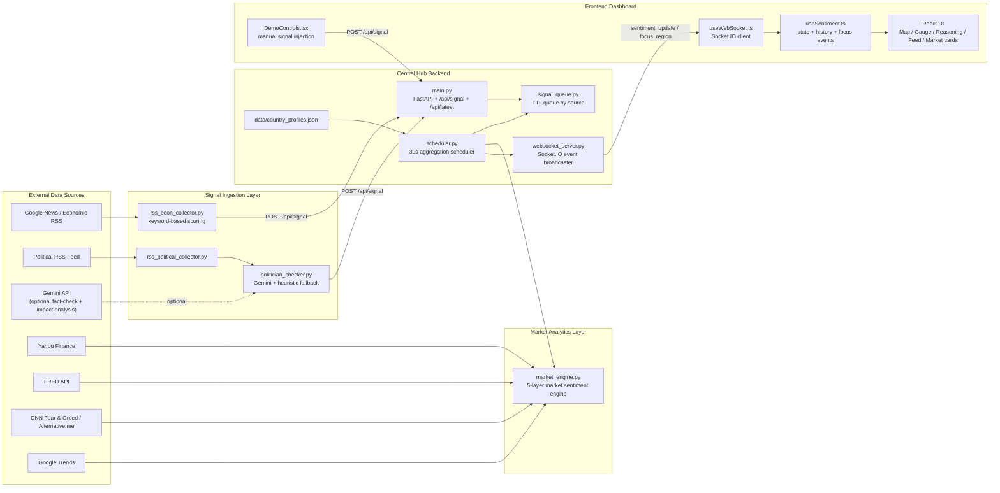
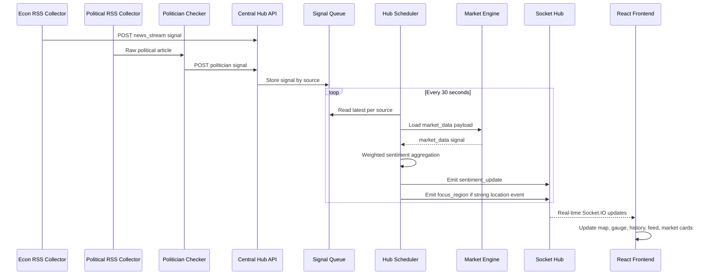

# Live Market Pulse Architecture

## One-line summary

Live Market Pulse collects economic RSS, political RSS, and 5-layer market data, converts them into normalized sentiment signals, aggregates them in a central hub, and streams the result to a React dashboard in real time.

## Slide-ready architecture

## Runtime flow

## Key design points

- The central hub is the orchestration core. It receives normalized signals, keeps only fresh signals in a TTL queue, and creates one unified `SentimentUpdate`.
- Market data is not pushed in from an external worker. The scheduler pulls it directly from `market_engine.py` during each aggregation cycle.
- Political signals are richer than the others: they include fact-check status, affected sectors, and optional event coordinates for map focus.
- The frontend is event-driven. It does not poll for updates; it subscribes to Socket.IO events and updates dashboard state in real time.
- Country-level side panels are enriched with static metadata from `data/country_profiles.json`.

## Suggested presentation framing

1. Data collection: RSS feeds and market sources are converted into three normalized signal types.
2. AI analysis: political content is fact-checked and market impact is estimated before entering the hub.
3. Aggregation: the hub combines market, news, and political signals into one weighted sentiment score.
4. Real-time delivery: Socket.IO pushes the result to the dashboard for live visualization.
