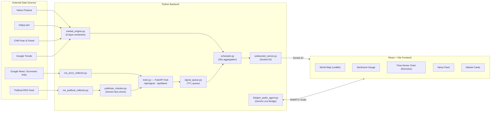

# 🌐 Live Market Pulse

> **Real-time global market sentiment dashboard powered by Gemini AI, Fishjam WebRTC, and live news intelligence.**
>
> Built for the **[Software Mansion × Google Gemini Hackathon 2026](https://hackathon.swmansion.com/)**

> 📦 **Original hackathon submission repository:** [YoungJun0814/SoftwareMansion_x_Gemini_Hackathon](https://github.com/YoungJun0814/SoftwareMansion_x_Gemini_Hackathon)

---

## 🏆 Hackathon Background

This project was originally created and submitted for the **Software Mansion × Google Gemini Hackathon 2026**, a hackathon focused on building real-world applications using Google's Gemini AI models alongside Software Mansion's open-source media infrastructure (Fishjam WebRTC, Smelter video compositor).

The hackathon challenged teams to combine **Google Gemini** with **Fishjam** — Software Mansion's WebRTC media server — to build novel real-time streaming or AI-powered applications.

Our team built **Live Market Pulse**: a multimodal financial intelligence platform that ingests live news, political events, and market data, processes them through Gemini AI, and delivers the result as a real-time global sentiment dashboard with a WebRTC-powered voice AI assistant.

---

## ✨ What is Live Market Pulse?

Live Market Pulse is a real-time financial intelligence dashboard that fuses multi-source news streams, macro-economic data, and political event analysis into a single, unified market sentiment score — updated every 30 seconds and pushed live to an interactive world map.

**Key capabilities:**
- 🗺️ **Interactive World Map** — country-level sentiment heatmap with auto-focus on breaking events
- 📡 **Real-time News Pipeline** — RSS ingestion from Google News (economic) and custom political feeds
- 🧠 **Gemini AI Analysis** — political articles are fact-checked, sector-tagged, and geo-located using Gemini
- 📊 **5-Layer Market Engine** — Yahoo Finance, FRED, CNN Fear & Greed, Google Trends all combined
- 🎙️ **Fishjam + Gemini Live Voice** — live audio agent bridging WebRTC room audio to Gemini Live API
- 🎬 **Smelter Video Overlays** — real-time market data composited on top of live broadcast streams
- ⚡ **Socket.IO Push** — no polling; the frontend receives instant updates via WebSocket events

---

## 🏗️ Architecture



---

## 🛠️ Tech Stack

| Layer | Technology |
|---|---|
| **Frontend** | React 19, TypeScript, Vite, Leaflet, Recharts, Framer Motion, Socket.IO |
| **Backend** | Python, FastAPI, APScheduler, Socket.IO |
| **AI** | Google Gemini API (fact-check), Gemini Live API (voice agent) |
| **WebRTC** | Fishjam Cloud (`fishjam-server-sdk`) |
| **Video** | Smelter (`@swmansion/smelter-node`) |
| **Market Data** | Yahoo Finance, FRED API, CNN Fear & Greed, Google Trends |
| **News** | RSS / Google News, custom political RSS feeds |

---

## 🚀 Getting Started

### Prerequisites

- Python 3.11+
- Node.js 20+
- A [Fishjam Cloud](https://fishjam.io/app) account
- A [Google AI Studio](https://aistudio.google.com/) Gemini API key
- A [FRED API](https://fred.stlouisfed.org/docs/api/api_key.html) key

### 1. Clone the repo

```bash
git clone https://github.com/YoungJun0814/SoftwareMansion_x_Gemini_Hackathon.git
cd SoftwareMansion_x_Gemini_Hackathon
```

### 2. Configure environment variables

```bash
cp backend/.env.example backend/.env
# Edit backend/.env and fill in your API keys
```

Required keys in `backend/.env`:

| Variable | Description |
|---|---|
| `GEMINI_API_KEY` | Google AI Studio API key |
| `FISHJAM_ID` | Fishjam Cloud project ID |
| `FISHJAM_MANAGEMENT_TOKEN` | Fishjam management token |
| `FRED_API_KEY` | FRED macro data API key |
| `TIM_POLITICAL_RSS_URL` | Political RSS feed URL |

### 3. Install backend dependencies

```bash
pip install -r backend/requirements.txt
```

### 4. Install frontend dependencies

```bash
cd frontend
npm install
```

### 5. Install Smelter dependencies (Linux/macOS only)

> ⚠️ Smelter requires Linux or macOS. It does **not** run natively on Windows.

```bash
cd smelter
npm install
```

---

## ▶️ Running the Project

Open separate terminals for each service:

```bash
# Terminal 1 — Central Hub API (FastAPI)
python -m backend.main

# Terminal 2 — Economic RSS Collector
python -m backend.rss_econ_collector

# Terminal 3 — Political RSS Collector
python -m backend.rss_political_collector

# Terminal 4 — Fishjam Gemini Live Voice Agent
python -m backend.fishjam_audio_agent

# Terminal 5 — Frontend Dev Server
cd frontend && npm run dev

# Terminal 6 — Smelter (Linux/macOS only)
cd smelter && npm run start
```

The dashboard will be available at **http://localhost:5173**

---

## 📁 Project Structure

```
├── backend/
│   ├── main.py                   # FastAPI hub — /api/signal, /api/latest
│   ├── scheduler.py              # 30s aggregation + Socket.IO broadcast
│   ├── signal_queue.py           # TTL-based signal queue by source
│   ├── market_engine.py          # 5-layer market sentiment engine
│   ├── rss_econ_collector.py     # Economic RSS ingestion pipeline
│   ├── rss_political_collector.py # Political RSS ingestion pipeline
│   ├── politician_checker.py     # Gemini fact-check + geo-location
│   ├── fishjam_audio_agent.py    # Fishjam ↔ Gemini Live audio bridge
│   ├── gemini_live_engine.py     # Gemini Live session manager
│   ├── websocket_server.py       # Socket.IO broadcaster
│   ├── config.py                 # Centralised env var loader
│   ├── models.py                 # Pydantic signal schemas
│   ├── requirements.txt
│   └── .env.example
├── frontend/
│   ├── src/
│   │   ├── App.tsx
│   │   ├── components/           # Map, Gauge, Chart, Feed, Market cards
│   │   ├── hooks/                # useWebSocket, useSentiment
│   │   └── types/
│   ├── package.json
│   └── vite.config.ts
├── smelter/
│   ├── server.ts                 # Smelter compositor server
│   ├── MarketOverlayScene.tsx    # React scene rendered by Smelter
│   └── package.json
├── data/
│   └── country_profiles.json     # Static country metadata
├── ARCHITECTURE.md               # Detailed architecture diagrams
└── README.md
```

---

## 🎙️ Fishjam Audio Agent

The `fishjam_audio_agent.py` bridges a Fishjam WebRTC room to **Google Gemini Live**, enabling real-time voice AI inside the dashboard:

1. The agent joins a Fishjam room as a peer
2. All audio from participants is forwarded to Gemini Live
3. Gemini's synthesised voice response is played back into the room
4. The frontend connects to the same room via the Fishjam client SDK

```
User mic → Fishjam room → fishjam_audio_agent → Gemini Live API → Fishjam room → User speaker
```

---

## 🤝 Team

Built by the **Live Market Pulse** team at the Software Mansion × Google Gemini Hackathon 2026.

---

## 📄 License

MIT
